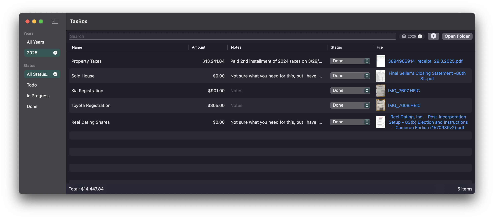

# 📦 TaxBox

> *Your financial documents, beautifully organized*

TaxBox is a native macOS application designed to transform the chaos of tax season into a streamlined, stress-free experience. Built with SwiftUI and crafted for simplicity, it provides a single source of truth for all your tax-related documents.


## 📸 Screenshot



*Clean, native macOS interface with document preview, metadata management, and smart filtering*

## ✨ Features

### 🎯 **Dead Simple Organization**
- **Drag & Drop**: Just drop files into TaxBox and they're instantly organized
- **Year-Based Structure**: Documents automatically sorted by tax year
- **Rich Metadata**: Add names, amounts, notes, and custom status tracking
- **Smart Search**: Find any document instantly by name, notes, or content

### 🔒 **Privacy-First Design**
- **100% Local Storage**: All documents stay on your Mac in `~/Documents/TaxBox/`
- **No Cloud Dependencies**: Works completely offline
- **Transparent Storage**: Browse your files directly in Finder anytime
- **Your Data, Your Control**: No accounts, no uploads, no tracking

### ⚡ **Powerful Yet Simple**
- **Configurable Root Folder**: Store documents wherever works for you
- **Custom Status System**: Create your own workflow states beyond "Todo/In Progress/Done"
- **Currency Support**: Automatic formatting based on your locale
- **Non-Destructive**: Copy files by default, never lose originals

### 🎨 **Native macOS Experience**
- **SwiftUI Native**: Feels like it belongs on your Mac
- **System Integration**: Respects Dark Mode, accessibility, and system preferences
- **Keyboard Shortcuts**: Navigate efficiently without touching the mouse
- **Quick Look Integration**: Preview documents with a single click

## 🚀 Getting Started

### Installation
1. Clone this repository
2. Open `ios/TaxBox/TaxBox.xcodeproj` in Xcode
3. Build and run (⌘R)

### First Use
1. **Drop Documents**: Drag tax documents into the main window
2. **Add Metadata**: Fill in document names, amounts, and notes
3. **Track Status**: Use the built-in statuses or create your own
4. **Stay Organized**: Filter by year, status, or search for specific documents

## 🏗 Architecture

### Design Philosophy
TaxBox follows a **file-system-first** approach that prioritizes transparency and user control:

```
~/Documents/TaxBox/
├── 2023/
│   ├── w2-form.pdf
│   ├── w2-form.pdf.meta.json
│   ├── mortgage-interest.pdf
│   └── mortgage-interest.pdf.meta.json
└── 2024/
    ├── receipt-office-supplies.pdf
    └── receipt-office-supplies.pdf.meta.json
```

### Key Principles
- **Simplicity First**: No complex workflows or configuration required
- **Local-First Storage**: Complete independence from cloud services
- **Non-Destructive Operations**: Safe handling of sensitive financial documents
- **Transparent Organization**: Human-readable structure accessible outside the app
- **Self-Healing**: Graceful degradation when metadata is missing

### Technical Stack
- **SwiftUI**: Modern, declarative UI framework
- **Foundation**: Core macOS APIs for file management
- **JSON**: Standard metadata format for maximum compatibility
- **UserDefaults**: Lightweight preference storage

## 🔧 Configuration

### Custom Root Folder
Change your document storage location via **Preferences → Document Storage Location**

### Status Customization
Add your own workflow states in **Preferences → Status Options**:
- Default: "Todo", "In Progress", "Done"  
- Examples: "Received", "Filed", "Audit Ready", "Archived"

### Import Behavior
Toggle between **Copy** (safer, default) and **Move** operations in settings

## 📁 File Structure

```
TaxBox/
├── ios/TaxBox/TaxBox/           # Main application
│   ├── Model.swift              # Core data models
│   ├── Views/
│   │   ├── ContentView.swift    # Main interface
│   │   ├── SettingsView.swift   # Preferences
│   │   └── ImportSheet.swift    # Document import flow
│   ├── Assets.xcassets/         # App icons and colors
│   └── TaxBox.entitlements     # Sandbox permissions
├── CLAUDE.md                    # Implementation notes
└── README.md                   # This file
```

## 🛠 Development

### Requirements
- macOS 13.0+
- Xcode 14.0+
- Swift 5.7+

### Building
```bash
# Clone the repository
git clone <repository-url>
cd TaxBox

# Open in Xcode
open ios/TaxBox/TaxBox.xcodeproj

# Build and run
# ⌘R in Xcode
```

### Testing Strategy
- **Real Document Testing**: PDF receipts, bank statements, tax forms
- **Edge Cases**: Special characters, large files, corrupted metadata
- **Performance Testing**: Hundreds of documents across multiple years
- **File System Edge Cases**: Permissions, network drives, concurrent access

## 🎨 Design Decisions

### Color Palette
- **Accent Color**: Sophisticated navy forest green (`#2E5753`)
- **Philosophy**: Understated, professional, trustworthy

### User Experience
- **Minimal Clicks**: Most actions require single click/drag
- **Visual Feedback**: Clear status indicators and progress feedback  
- **Error Resilience**: Graceful handling of missing files or metadata
- **Keyboard Friendly**: Full navigation without mouse

## 🔮 Future Possibilities

### Potential Enhancements
- **OCR Integration**: Auto-extract amounts and dates from documents
- **Receipt Scanning**: Direct camera integration for mobile receipts
- **Tax Software Export**: Generate compatible import files for TurboTax, etc.
- **Backup Integration**: Enhanced Time Machine awareness
- **Multi-User Support**: Separate spaces for household members
- **Report Generation**: Year-end summaries and analytics

### Integration Opportunities  
- **Email Monitoring**: Auto-import from specific senders (banks, employers)
- **Cloud Backup**: Optional sync with iCloud/Dropbox for backup only
- **Financial Apps**: Pull statements from banks and brokers
- **Reminder System**: Notifications for expected documents

## 📄 License

This project is licensed under the MIT License - see the LICENSE file for details.

## 🤝 Contributing

TaxBox is designed to solve real problems for real people. Contributions should:
- **Preserve Simplicity**: Every feature should have clear, immediate value
- **Respect Privacy**: No telemetry, tracking, or cloud dependencies
- **Maintain Transparency**: Users should always understand what's happening
- **Follow Apple HIG**: Native look, feel, and behavior

## 💝 Acknowledgments

Built with ❤️ for everyone who's ever faced a pile of receipts in March and wondered "where did I put that W-2?"

---

*TaxBox: Because your documents deserve better than a Downloads folder.*